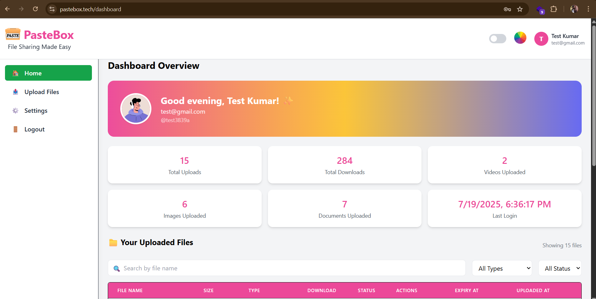
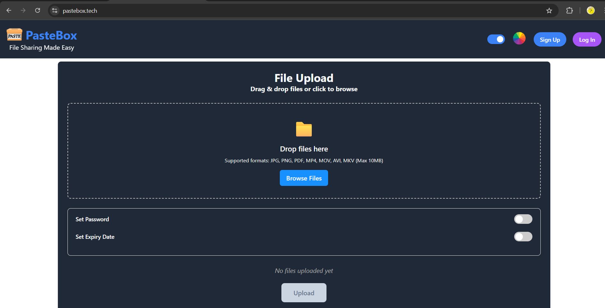
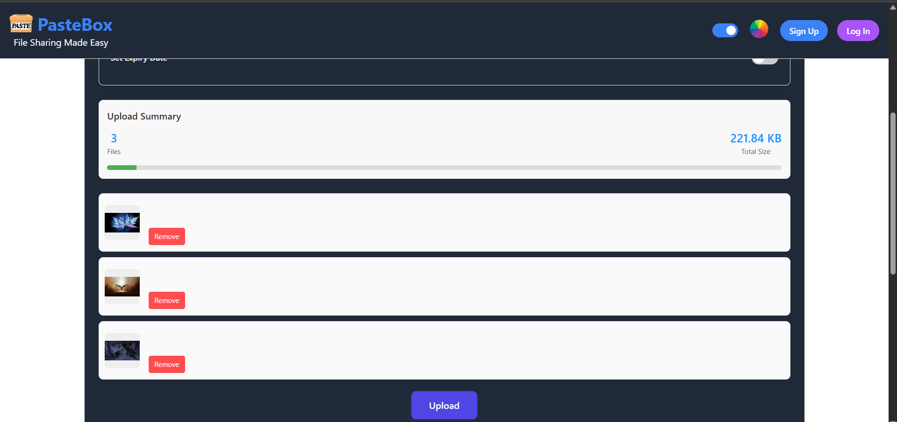
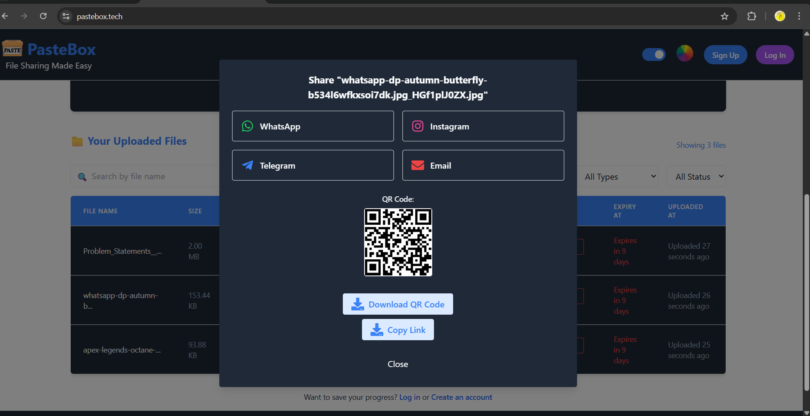
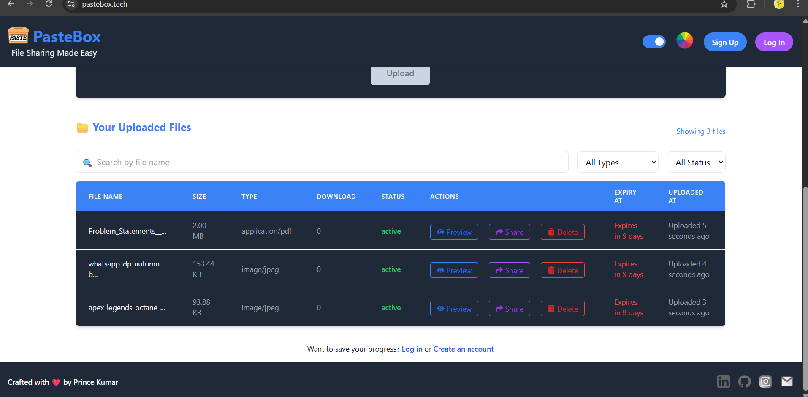

# PasteBox

PasteBox is a MERN-based file sharing and storage platform built for fast, controlled, and user-friendly file delivery. It supports both guest and registered user workflows, short share links, password-protected access, expiry controls, file previews, bundle sharing, and cloud storage through AWS S3.

## Overview

The project is split into two apps:

- `client/`: React + Vite frontend
- `server/`: Express + MongoDB + AWS S3 backend

PasteBox is designed for scenarios where users need to upload a file, generate a clean link, optionally protect it with a password or expiry, and share it quickly without dealing with heavy cloud-drive workflows.

## Core Features

- Guest file upload without mandatory signup
- User registration and login with email/password
- Google OAuth login
- Authenticated dashboard for registered users
- Upload one or many files
- Shareable short links for files
- Bundle sharing for multiple files under one link
- Password-protected file and bundle access
- Expiry-based sharing controls
- File preview for supported file types
- Download tracking and dashboard stats
- Guest file history stored in browser `localStorage`
- QR code generation and share modal support

## Tech Stack

### Frontend

- React 18
- Vite
- React Router DOM
- Redux Toolkit
- Tailwind CSS
- Axios
- React Dropzone
- React Toastify
- React Icons
- React QR Code
- React Share

### Backend

- Node.js
- Express
- MongoDB + Mongoose
- JWT authentication
- bcryptjs
- cookie-parser
- cors
- multer
- nodemailer

### Cloud and External Services

- AWS S3 for file storage
- MongoDB Atlas or local MongoDB for metadata
- Google OAuth 2.0 for social login

## How It Works

1. A guest or logged-in user uploads one or more files from the frontend.
2. The backend receives the files with `multer` and stores them in AWS S3.
3. File metadata is saved in MongoDB.
4. PasteBox generates a short file or bundle link for sharing.
5. Recipients can open the link, preview metadata, verify passwords if required, and download the file.
6. Registered users can manage uploads from a dashboard with search, filtering, and sharing actions.

## Project Structure

```text
pastebox-file-sharing-platform/
├── client/
│   ├── public/
│   ├── src/
│   │   ├── assets/
│   │   ├── components/
│   │   │   ├── Auth/
│   │   │   ├── Dashboard/
│   │   │   ├── Guest/
│   │   │   └── ui/
│   │   ├── config/
│   │   └── redux/
│   ├── package.json
│   └── vite.config.js
├── server/
│   ├── src/
│   │   ├── config/
│   │   ├── controllers/
│   │   ├── db/
│   │   ├── middlewares/
│   │   ├── models/
│   │   ├── routes/
│   │   ├── app.js
│   │   └── index.js
│   └── package.json
├── PROJECT_REPORT.md
└── README.md
```

## Frontend Routes

The client defines these main routes:

- `/` - guest landing page and upload flow
- `/login` - login page
- `/signup` - signup page
- `/dashboard` - authenticated user dashboard
- `/f/:shortCode` - registered file download page
- `/g/:shortCode` - guest file download page
- `/bundle/:bundleCode` - registered bundle page
- `/guest-bundle/:bundleCode` - guest bundle page

## Backend API Overview

### Auth Routes

Base paths used by the server:

- `/api/auth`
- `/api/users`

Important endpoints:

- `POST /register`
- `POST /signup`
- `POST /login`
- `POST /logout`
- `POST /refresh`
- `GET /google`
- `GET /google/callback`
- `GET /me`

### File Routes

Base path:

- `/api/files`

Important endpoints:

- `POST /upload`
- `POST /upload-guest`
- `GET /download/:fileId`
- `DELETE /delete/:fileId`
- `PUT /update/:fileId`
- `GET /getFileDetails/:fileId`
- `GET /showUserFiles`
- `GET /searchFiles`
- `POST /generateShareShortenLink`
- `POST /sendLinkEmail`
- `POST /FileExpiry`
- `POST /updateAllFileExpiry`
- `POST /updateFilePassword`
- `GET /generateQR/:fileId`
- `GET /getDownloadCount/:fileId`
- `GET /f/:shortCode`
- `GET /g/:shortCode`
- `GET /bundle/:bundleCode`
- `GET /guest-bundle/:bundleCode`
- `GET /resolveShareLink/:code`
- `POST /verifyFilePassword`
- `POST /verifyGuestFilePassword`
- `POST /verifyBundlePassword`
- `POST /verifyGuestBundlePassword`
- `POST /createGuestBundleShare`
- `GET /getUserFiles/:userId`

## Data Models

### User

The user model stores:

- `fullname`
- `username`
- `email`
- `password`
- `authProvider`
- `googleId`
- `refreshTokenHash`
- `totalUploads`
- `totalDownloads`
- `videoCount`
- `imageCount`
- `documentCount`
- `profilePic`
- `lastLogin`

### File

The file model stores:

- `path`
- `name`
- `type`
- `size`
- `downloadedContent`
- `isPasswordProtected`
- `password`
- `hasExpiry`
- `expiresAt`
- `status`
- `shortUrl`
- `bundleCode`
- `bundleShortUrl`
- `createdBy`

### GuestFile

The guest file model mirrors most file metadata but stores `createdBy` as a string value for guest ownership tracking.

## Authentication Flow

- Local auth uses JWT access and refresh tokens.
- Client tokens are stored in browser `localStorage`.
- Axios automatically adds the access token to requests.
- On `401` responses, the client attempts token refresh through `/auth/refresh`.
- Google OAuth login is available through the backend auth routes.

## Environment Variables

Create a `.env` file inside `server/`.

### Required server variables

```env
PORT=5600
MONGODB_URL=your_mongodb_connection_string
DB_NAME=SharePod
CLIENT_URL=http://localhost:5173
BASE_URL=http://localhost:5600
NODE_ENV=development

JWT_SECRET=your_jwt_secret
JWT_REFRESH_SECRET=your_jwt_refresh_secret

AWS_ACCESS_KEY_ID=your_aws_access_key_id
AWS_SECRET_ACCESS_KEY=your_aws_secret_access_key
AWS_REGION=your_aws_region
AWS_BUCKET_NAME=your_s3_bucket_name

GOOGLE_CLIENT_ID=your_google_client_id
GOOGLE_CLIENT_SECRET=your_google_client_secret
GOOGLE_REDIRECT_URI=http://localhost:5600/api/auth/google/callback

MAIL_USER=your_email_address
MAIL_PASS=your_email_password_or_app_password
```

Notes:

- `CLIENT_URL` must match the frontend origin for CORS and OAuth redirects.
- `BASE_URL` should point to the backend host used for server-generated links.
- `JWT_REFRESH_SECRET` falls back to `JWT_SECRET` if omitted, but setting both is better.
- `DB_NAME` exists in code as a constant and defaults to `SharePod`.

### Client variables

Create a `.env` file inside `client/` if you want to override the default API base:

```env
VITE_API_URL=http://localhost:5600
```

If `VITE_API_URL` is not set, the client defaults to `/api/`.

## Local Development Setup

### 1. Clone the repository

```bash
git clone <your-repository-url>
cd pastebox-file-sharing-platform
```

### 2. Install frontend dependencies

```bash
cd client
npm install
```

### 3. Install backend dependencies

```bash
cd ../server
npm install
```

### 4. Configure environment variables

- Add `server/.env`
- Optionally add `client/.env`

### 5. Start the backend

```bash
cd server
npm run dev
```

### 6. Start the frontend

Open a second terminal:

```bash
cd client
npm run dev
```

### 7. Open the app

Visit:

- Frontend: `http://localhost:5173`
- Backend: `http://localhost:5600`

## Available Scripts

### Client

From `client/`:

```bash
npm run dev
npm run build
npm run preview
npm run lint
```

### Server

From `server/`:

```bash
npm run dev
npm start
```

## Screenshots

### User Dashboard



### Guest Dashboard



### Upload Flow



### Share Modal



### File Preview



## Deployment Notes

- The frontend appears prepared for Vercel deployment through `client/vercel.json`.
- The backend can be deployed separately on any Node-compatible host.
- Update `CLIENT_URL`, `BASE_URL`, and `VITE_API_URL` for production.
- Google OAuth redirect URIs must exactly match the deployed backend callback URL.
- AWS S3 bucket permissions and CORS settings must allow your upload and download flow.

## Current Limitations

- Guest file history depends on browser storage and is not portable across devices.
- Large-file behavior depends on hosting limits, S3 configuration, and request size handling.
- Preview support depends on file type and browser capabilities.
- Email sharing depends on valid mail credentials and provider configuration.

## Future Improvements

- Folder upload support
- Admin panel and moderation tools
- Role-based access control
- Stronger analytics and reporting
- File compression and scanning
- Permanent guest-to-user migration flow
- Real-time notifications
- Native mobile client

## Documentation

- Project report: [PROJECT_REPORT.md](./PROJECT_REPORT.md)
- Frontend package config: [client/package.json](./client/package.json)
- Backend package config: [server/package.json](./server/package.json)

## License

Add your preferred license here if you plan to distribute the project publicly.
